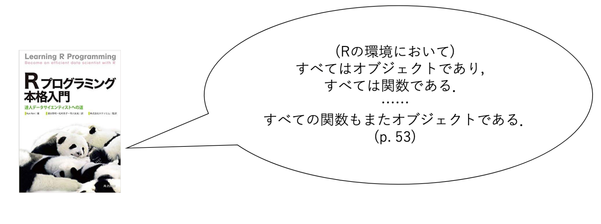
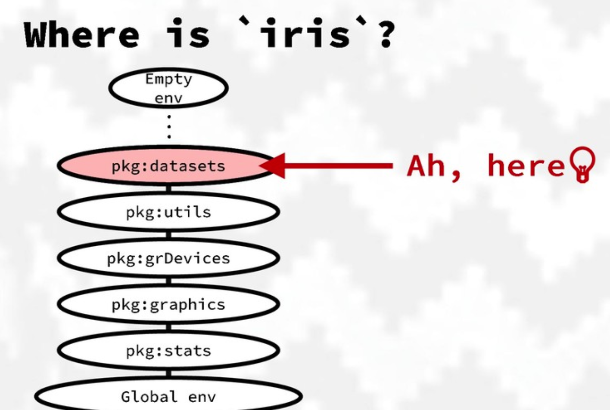
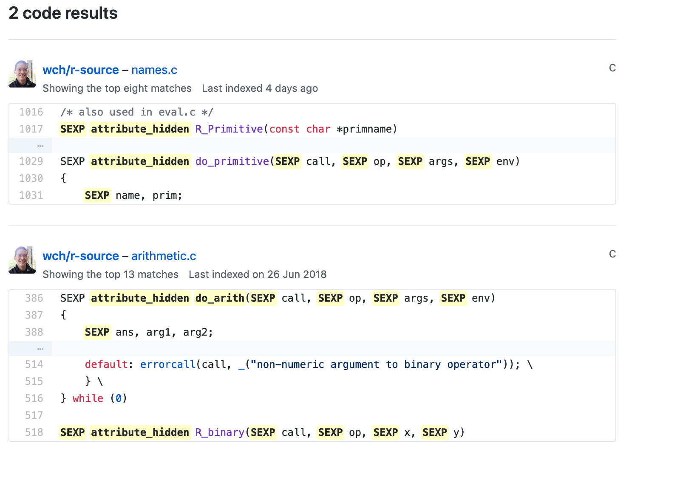

```{r eval=TRUE, echo=FALSE, warning=FALSE, message=FALSE, comment=""}
knitr::opts_chunk$set(echo = TRUE,
                      eval = TRUE,
                      warning = FALSE,
                      message = FALSE,
                      comment = "",
                      fig.height = 10,
                      fig.width = 10,
                      out.height = 300,
                      out.width = 300)
options(dplyr.print_max = 1e9)
```
# はじめに

## 誰？

<div class="column1">
- 松村優哉
- <u>Twitter</u>: **y\_\_mattu**
- <u>GitHub</u>: **ymattu**
- 大学院生
- 計量経済学、ベイズ統計、因果推論、マーケティング
- 言語: R, Python, SAS
- https://ymattu.github.io/
- http://y-mattu.hatenablog.com/
- Tokyo.R 運営
</div>

<div class="column2">

</div>

## 著書 {#bo}

#### **R ユーザのための RStudio[実践]入門 <br> − tidyverse によるモダンな分析フローの世界−**
<div class="column1">

</div>

<div class="column2">
- 通称: 「**宇宙本**」
1. RStudio 入門(@y\_\_mattu)
2. スクレイピングによるデータ取得(@y\_\_mattu)
3. dplyr を中心としたデータハンドリング(@yutannihilation)
4. ggplot2 による可視化(@kyn02666)
5. R Markdown によるレポーティング(@kazutan)
</div>

## 今日のお話 {#todys_theme}
- 導入
    - 総称関数
- 演算子の挙動
    - 関数の実行環境
    - 演算子の中身
- まとめ

※20分しかないので簡単に。

## 今日はパッケージ名だけでも<br>覚えて帰ってくださいねm(_ _)m 

# 本日の目標 {#todays_goal}
## これを理解する {#understand_this}

```{r, todays_goal}
result <- 1 + 2
print(result)
``` 

とくに `result <- 1 + 1` の部分

## 前回のTokyo.Rで... {#last_tokyor}
[宇宙が生まれる前の話](https://github.com/8-u8/TokyoR/blob/master/20190119/R%E8%A8%80%E8%AA%9E%E8%B6%85%E5%85%A5%E9%96%80_opened.pdf)


## 大切なこと {#most_important}
「Rのすべての関数はオブジェクトであり、すべてのオブジェクトは関数である。」 

↓

「**R上での全ての挙動は関数の実行である**。」

# 余談 {#bytheway}
## ここでは何が起こっているのか {#what_happened_here}
```{r}
print(result)
```

- `print.default()` が実行されている
- `print()` は **総称関数** と呼ばれる関数で、引数の中身(のクラス)によって特定の関数が呼び出される
- 「メソッドがディスパッチされる」という言い回しをします
- 他には `head()`, `plot()`, `summary()` など


## 総称関数1 {#usemethod1}
- Rでは、関数をカッコ無しでREPLに入れるとその中身が表示される
- なぜならば、全ての関数はオブジェクトだから
- 総称関数は、 `UseMethod("")` という表示が出てくる
```{r, look_print}
print
```

## 総称関数2 {#usemethod2}
メソッド一覧は `methods()` 関数で見る

```{r, print_methods}
methods("print")
```

## 総称関数3 {#usemethod3}
どのメソッドがディスパッチされたかは `sloop::s3_dispatch()` でわかる

```{r, s3_dispatch}
# install.packages("sloop")
sloop::s3_dispatch(print(result))
```

## 総称関数4 {#usemethod4}
```{r}
print.default
```

# ようやく演算子のお話 {#operator}
## 冒頭の格言を思い出す {#remember}
「Rのすべての関数はオブジェクトであり、すべてのオブジェクトは関数である。」

## つまり {#imean}
演算子も関数→`関数名()` という書き方ができるはず！

```{r, lisplike}
`+`(1, 2) # 1 + 1 と同じ

`<-`(a, 1 + 2) # a <- 1 + 2 と同じ
print(a)
```

※これはあくまで「演算子も関数であるというのを分かりやすくしているだけなので、Rでは普通こういう書き方はしません。(Lispっぽい書き方)」

# ここからが本題
## 今日使うパッケージ {#todays_pkg}
```{r, pkg, eval=FALSE}
install.packages("pryr")
install.packages("lobstr")
install.packages("sloop")
install.packages("rlang")
```

注）dplyrの前身のplyrというパッケージがありましたがそれとは別物です

## `1 + 2` を読み解く {#oneplustwo}
- `lobstr::ast()` で構造を確認
- どのような順序で関数が実行されているのかがわかる

```{r}
lobstr::ast(1 + 2)
```


## ここでは何が起こっているのか {#what_happened_here2}
```{r}
1 + 2
```

言い換えると、「`` `+`() `` 関数が実行されるときに何が起こっているのか」

## これを知るために理解してきたいこと {#weneed}
- 実行環境
- `` `+()` `` 関数の中身


# 実行環境 {#environment}
## 環境とは {#whats_env}
- Rではオブジェクト(ここでは `` `+`() `` 関数 )が呼び出されたとき、それを探しに行きます。
1. まず身近な相手にそれを持ってるか聞く。
2. その人が持ってなかった時、じゃあ次はこの人に聞いてね、っていうのを教えてくれる
3. それをずーっとたどっていって最後まで誰も持ってなかったらエラー。


###### [（Rの）環境問題について　その１。](https://qiita.com/kohske/items/325bdf48f4f4885a86f1)より

## イメージは {#img_env}


[Yet Another Introduction to tidyeval](https://speakerdeck.com/yutannihilation/yet-another-introduction-to-tidyeval?slide=19)より

## 最初に聞く相手は `.GlobalEnv`
```{r}
ls(pos = .GlobalEnv)
```

## `rlang::env_parent()` で<br>次の相手を教えてもらう {#env_parent}
```{r}
rlang::env_parent(.GlobalEnv)
```


## `rlang::env_parents()` で<br>聞く相手の順番を教えてもらう  {#env_parents}

```{r}
rlang::env_parents(.GlobalEnv)
```

`search()` でも良い

## で、 `` `+`() `` は誰が持ってるの？ {#whreplus}
```{r}
pryr::where("+")
```

`find()` でも良い

## ここまでで分かったこと {#wefind}
- ` 1 + 2` は `` `+`(1, 2) `` を実行した結果である。
- `` `+`() `` 関数はbaseパッケージが持っていて、そこから呼び出される

# `` `+()` `` 関数の中身 {#search_plus}
## `` `+`() `` 関数の中身を見ると... {#inseide_plus}
```{r, inside_plus}
`+`
```

## `.Primitive()` {#primitive}
- base パッケージの中でC言語の関数を呼び出すために使われる特殊な関数
- `.Interenal` というのもあります。

## `.Primitive()` その2 {#primitive2}
- Rの関数は通常以下の3要素を持つ
    - body: 関数内部のRコード
    - formals: 引数の集まり
    - environment: 環境
```
func_name <- (arg1, arg2, ...) {
  do something
}
```

## が、 `.Primitive()` の関数だけは例外 {#except}
なぜならば、Rのコードが含まれないから
```{r}
body(`+`)
formals(`+`)
environment(`+`)
```


## C言語の関数の探し方 {#search_c_func}
- Rのソースコードから探す
    1. `src/main/names.c` からCで定義された関数を見つける
    2. Rのソースコードを見る
- `pryr::show_c_source()` を使うと簡単

## `pryr::show_c_source()` {#show_c_source}
```
> pryr::show_c_source(.Primitive("+"))
+ is implemented by do_arith with op = PLUSOP
```



## C関数の中身は... {#insideCfunc}
- すいませんそこまで手が回りませんでした。。。
- というかC言語にそんなに詳しくない。。。

# まとめ {#matome}
## 最初の目標 {#goal}
すごく単純なコードでも、また違って見えて面白いですね
```{r, todays_goal2}
result <- 1 + 2
print(result)
``` 

## 分かったこと {#wakattakoto}
- `result <- 1 + 2` は `` `<- `(result,  `+`(1, 2)) `` を実行した結果である。
- `` `+`() `` 関数はbaseパッケージが (という環境) が持って、そこから呼び出される
- ちなみに`` `<-()` `` 関数も同じ
- `` `+`() `` 関数は `.Primitive("+")` というRのソースコード(C言語)の中で定義された関数が呼び出されたものだった

## 演算子 {#operator_matome}
- 普段何気なく使ってる演算子でもちゃんと理解しようとするとけっこう大変
- でも(ある程度)分かっておくとパッケージ開発の時とか超便利 <br>
→環境とかをちゃんと理解しておくと、パイプ演算子(`%>%`)の[ソースコード](https://github.com/tidyverse/magrittr/blob/master/R/pipe.R)が読めるようになる

## Rの内部を探る三種の神器 {#three_pkgs}
- [rlang](https://github.com/r-lib/rlang)
- [pryr](https://github.com/hadley/pryr)
- [sloop](https://github.com/r-lib/sloop)

## 本資料について {#revealjs}
- revealjs パッケージで作りました。
- 以下の URL で公開しています。 <br> https://ymattu.github.io/TokyoR76/slide.html#/

## 参考文献1 {#ref1}
- https://qiita.com/kohske/items/325bdf48f4f4885a86f1
- http://rtokei.tech/r/r%E3%81%AE%E3%81%93%E3%81%A8%E3%82%92%E5%AD%A6%E3%81%B6010s3%E3%82%AF%E3%83%A9%E3%82%B9/
- https://notchained.hatenablog.com/entry/2018/11/11/162550
- http://mukkujohn.hatenablog.com/entry/2016/07/13/220822

## 参考文献2 {#ref2}
R言語徹底解説 (原著: [Advanced R](http://adv-r.had.co.nz/))


## Enjoy! {#enjoy}
